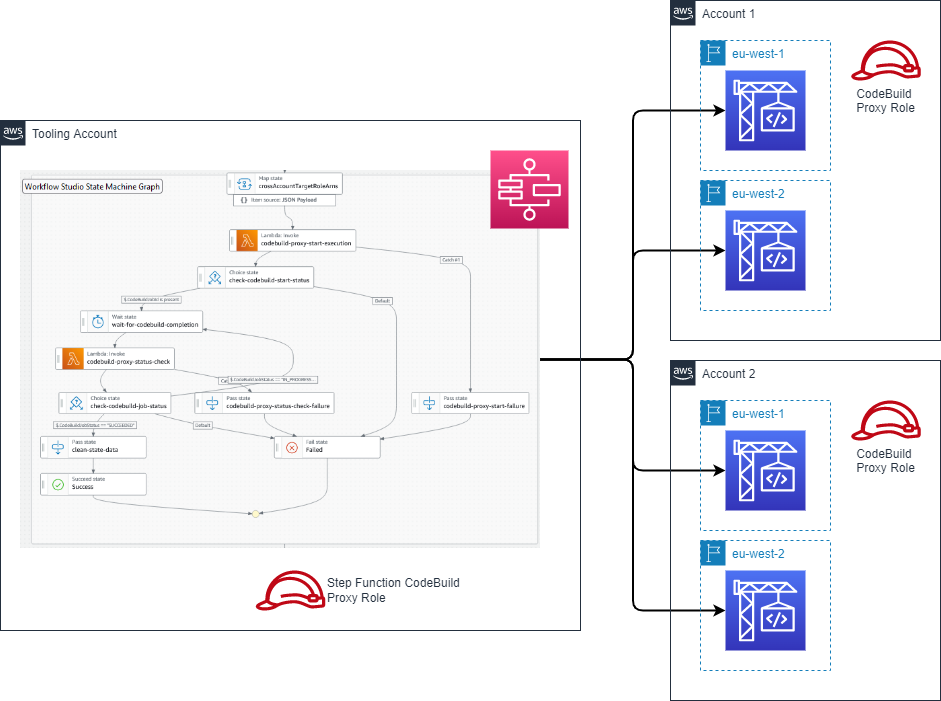

## Cross Account CodeBuild Proxy

### Summary

AWS CodeBuild provides an easy mechanism to execute commands from a Linux shell with a configurable IAM principal. This enables a variety of operational tasks, with environment variables used at runtime to control behavior.

This sample code provides an example of how AWS CodeBuild projects can be orchestrated across account boundaries, for example a central account could execute AWS CodeBuild projects across every account in an AWS Organization. The solution takes as input a map which includes the role to assume and the CodeBuild project name; with the ability to optionally specify environment variables to override behaviour on a per-account basis.

### Features

The included AWS Lambda function provides a method to start AWS CodeBuild projects, along with a method to check the status of a particular AWS CodeBuild execution ID.

This may be combined with the sample AWS Step Function state machine to implement a workflow which starts AWS CodeBuild projects in a remote accounts with environment variable overrides, before regularly polling the execution status and capturing the final result. 

### Solution Architecture

The solution architecture is shown below:



The solution is delivered via two AWS CloudFormation templates. 

The template *codebuild_lambda_proxy_template.yaml* will deploy the AWS Lambda function and the sample AWS Step Function state machine, along with supporting IAM roles. This should be deployed first to ensure the IAM principals may be used as trusted entities. 

The second template *sample_target_codebuild_template.yaml* will deploy a sample AWS CodeBuild project which may be used to test the sample. It will also deploy two IAM roles, one for AWS CodeBuild and one which is to be assumed from the AWS account which contains the AWS Lambda proxy. 

### Sample Step Function input

```
{ 
    "crossAccountTargetRoleArns": [ 
        { 
            "arn": "arn:aws:iam::111111111:role/proxy-lambda-codebuild-role", 
            "region": "eu-central-1", 
            "codeBuildProject": "sample-codebuild-project", 
            "SampleValue1": "Value1", 
            "SampleValue2": "Value2" 
        }, 
        { 
            "arn": "arn:aws:iam::111111111:role/proxy-lambda-codebuild-role", 
            "region": "us-east-1", 
            "codeBuildProject": "sample-codebuild-project", 
            "SampleValue1": "Value1", 
            "SampleValue2": "Value2" 
        }, 
        { 
            "arn": "arn:aws:iam::111111111:role/proxy-lambda-codebuild-role", 
            "region": "ap-south-1", 
            "codeBuildProject": "sample-codebuild-project", 
            "SampleValue1": "Value1", 
            "SampleValue2": "Value2" 
        } 
    ] 
}
```

## Security

See [CONTRIBUTING](CONTRIBUTING.md#security-issue-notifications) for more information.

## License

This library is licensed under the MIT-0 License. See the LICENSE file.

